# Отчет по лабораторной работе №1: базовая настройка PostgreSQL на Debian.
# Шикан Алексей Владимирович ИС-21


1.  **Подготовка среды**

Шаг 1. Для выполнения лабораторной работы была использована виртуальная
машина в VirtualBox.

Шаг 2. После установки системы был выполнен вход под обычным
пользователем (user). Для выполнения административных задач используем
команду:

```su -```

После успешного ввода пароля доступ был получен к root-аккаунту, что
подтверждается командной строкой ```root@DEBIAN:\~#```.

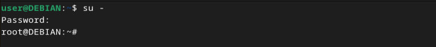

Шаг 3. После входа в систему необходимо обновить список пакетов и
выполнить обновление установленных пакетов. Используем следующую
команду:

```apt-get update && apt-get upgrade```

Разбор команды:

-   ```apt-get update``` -- обновляет список доступных пакетов и их версий из
    репозиториев. Это не обновляет сами пакеты, а только загружает
    информацию о новых версиях.

-   ```apt-get upgrade``` -- обновляет установленные пакеты до последних
    доступных версий, если они есть в репозитории.

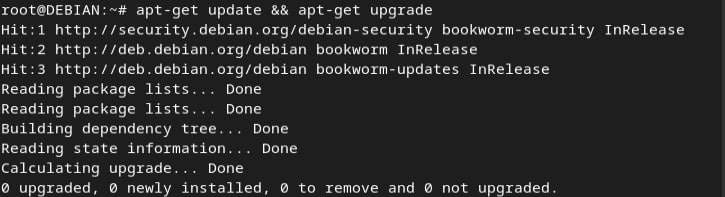

2.  **Установка PostgreSQL**

Шаг 1. Для установки PostgreSQL используем команду:

```sudo apt-get install postgresql```

Разбор команды:

-   ```sudo``` --- выполнение команды с правами суперпользователя.

-   ```apt-get install postgresql``` --- установка пакета PostgreSQL из
    официальных репозиториев Debian.

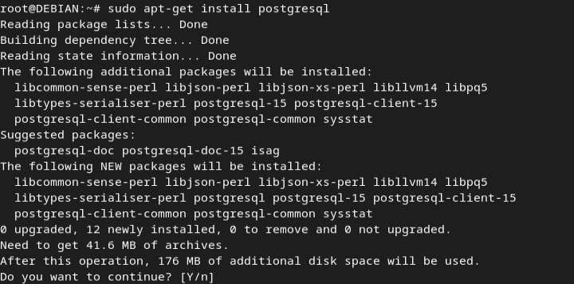

Шаг 2. После установки сервера была дополнительно установлена клиентская
утилита postgresql-client для работы с базой данных через терминал.

```sudo apt-get install postgresql-client```

Разбор команды:

-   ```sudo``` --- выполнение с правами суперпользователя.

-   ```apt-get install postgresql-client``` --- установка клиентских утилит
    PostgreSQL.

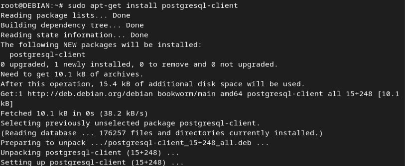

3.  **Создание служебной учётной записи**

Шаг 1. Для проверки наличия данной учетной записи была выполнена команда

```id postgres```


Результат:

-   uid=112(postgres) -- уникальный идентификатор пользователя (User
    ID).

-   gid=122(postgres) -- идентификатор основной группы (Group ID).

-   groups=122(postgres),110(ssl-cert) -- пользователь postgres также
    входит в группу ssl-cert, что может быть полезно для работы с
    сертификатами SSL.

Назначение учетной записи postgres:

-   Это служебный пользователь, созданный автоматически при установке
    PostgreSQL.

-   Он используется для запуска службы PostgreSQL и управления базами
    данных.

-   Данный пользователь не имеет пароля и не может войти в систему, но
    его можно использовать для работы с PostgreSQL через sudo -u
    postgres.

Шаг 2. После установки PostgreSQL необходимо убедиться, что служба базы
данных работает.

Для этого были выполнены команды:

```systemctl start postgresql```

```systemctl status postgresql```

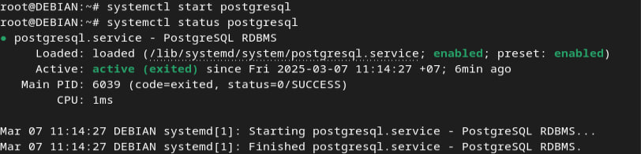

Результат:

-   Сервис postgresql.service загружен (loaded).

-   Статус Active (exited), что означает, что PostgreSQL запущен и
    успешно завершил инициализацию.

-   Сервис автоматически включен при загрузке (enabled; preset:
    enabled).

 Назначение и права:

-   Учетная запись postgres отвечает за запуск сервиса PostgreSQL.

-   Все процессы PostgreSQL в системе выполняются от имени этого
    пользователя.

-   Он имеет права на управление базами данных, но не имеет привилегий
    root в системе.

4.  **Первичная настройка конфигурационных файлов**

После установки и запуска PostgreSQL необходимо выполнить его базовую
конфигурацию, изменив параметры работы сервера и настройки
аутентификации.

Шаг 1. PostgreSQL использует несколько конфигурационных файлов, которые
находятся в каталоге: /etc/postgresql/15/main/

Ключевые файлы:

-   ```postgresql.conf``` --- основной конфигурационный файл сервера
    PostgreSQL.

-   ```pg_hba.conf``` --- файл управления методами аутентификации
    пользователей.

-   ```pg_ident.conf``` --- используется для сопоставления пользователей ОС с
    пользователями PostgreSQL.

Шаг 2. Для редактирования файлов от имени пользователя postgres
выполнена команда:

```sudo -i -u postgres```


После этого изменены основные файлы конфигурации. Файл открыт в
редакторе nano:

```sudo nano /etc/postgresql/15/main/postgresql.conf\\```

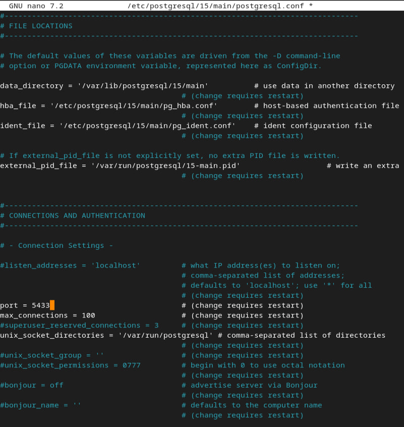

Изменен параметр порта подключения PostgreSQL: ```port = 5433```

Что это дает?

По умолчанию PostgreSQL использует порт 5432, но его можно изменить,
например, на 5433, если требуется запуск нескольких серверов PostgreSQL
на одной машине.

Шаг 3. Настройка аутентификации в pg_hba.conf.

Открываем файл:

```sudo nano /etc/postgresql/15/main/pg_hba.conf```

Изменены настройки аутентификации

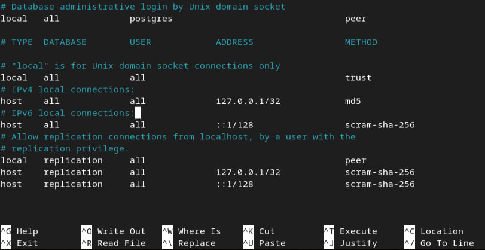

Что это дает?

-   ```trust``` --- разрешает вход без пароля (удобно для локальной отладки).

-   ```md5``` --- требует пароль, захешированный алгоритмом MD5.

-   ```scram-sha-256``` --- более безопасная аутентификация.

-   ```peer``` --- проверяет, совпадает ли системный пользователь Linux с
    пользователем PostgreSQL. Если имена совпадают -- подключение
    разрешается без пароля.

Также сохраняем и перезапускаем


Шаг 4. Проверяем порт можно через:

```netstat -tuln \| grep 5433```

Или через команду

```ss -tuln \| grep 5433```

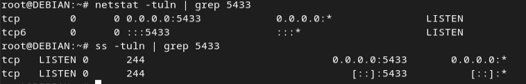

5.  **Управление сервисом**

Шаг 1. Для проверки состояния PostgreSQL была выполнена команда:

```sudo systemctl status postgresql```

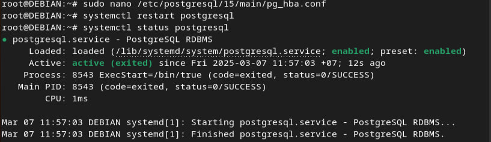

Шаг 2. Чтобы PostgreSQL автоматически запускался при загрузке системы,
выполнена команда

```sudo systemctl enable postgresql```

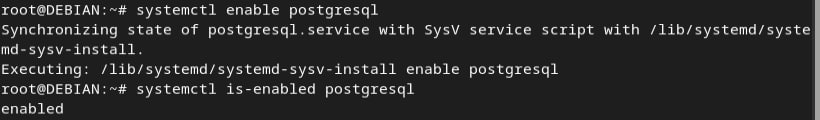

Результат:

-   Systemd подтвердил успешную синхронизацию с системой и включение
    автозапуска.

-   Проверка состояния автозапуска

```systemctl is-enabled postgresql```

Шаг 3. Если сервис не был запущен, его можно запустить командой:

```sudo systemctl start postgresql```

Если необходимо перезапустить сервис (например, после изменения
конфигурации):

```sudo systemctl restart postgresql```

Для временной остановки сервиса:

```sudo systemctl stop postgresql```

6.  **Создание тестовой базы данных**

Шаг 1. Подключаемся к postgres указывая localhost и новый порт 5433

```psql -h localhost -p 5433 -U postgres```

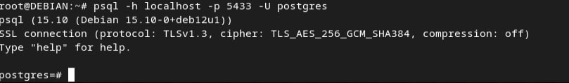

Шаг 2. Чтобы создать нового пользователя, в psql была выполнена команда:

```CREATE USER sav WITH PASSWORD \'12345\';```

Шаг 3. Чтобы создать базу данных с владельцем выполнена команда:

```CREATE DATABASE bd1 OWNER sav;```

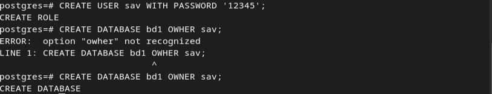

Шаг 4. Чтобы проверить список пользователей в PostgreSQL, была выполнена
команда:

```\\du```

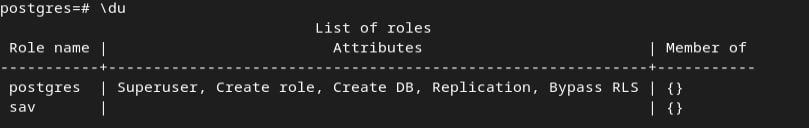

Шаг 5. Проверка списка баз данных:

```\\l```

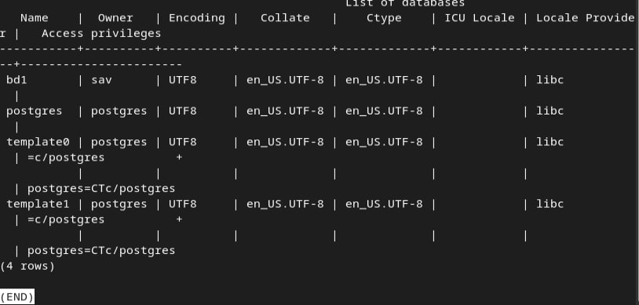{width="6.496527777777778in"
height="3.1046052055993in"}

7.  **Знакомство со схемами**

В PostgreSQL схема -- это логическая группа объектов базы данных
(таблиц, представлений, индексов, функций и т. д.).

База данных -- это контейнер для хранения схем.

Схема -- это подмножество объектов внутри базы данных.

Простая аналогия:

-   База данных -- это библиотека.

-   Схемы -- это разделы библиотеки (научная литература, художественная,
    справочники).

-   Таблицы -- это книги внутри каждого раздела.

По умолчанию в каждой базе данных существует схема public, в которой
хранятся все объекты, если не указана другая схема.

Шаг 1. Создадим схему test_schema

CREATE SCHEMA test_schema;

Чтобы пользователь sav мог использовать эту схему, нужно дать ему права:

GRANT USAGE ON SCHEMA test_schema TO sav;

GRANT CREATE ON SCHEMA test_schema TO sav;

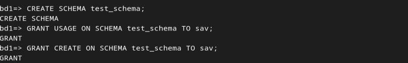{width="6.496527777777778in"
height="1.0143274278215224in"}

Объяснение:

-   USAGE -- позволяет пользователю использовать объекты схемы.

-   CREATE -- разрешает создавать объекты внутри схемы.

Шаг 2. Создадим таблицу schema_table в схеме по умолчанию:

CREATE TABLE \"schema_table\" (

\"id\" int PRIMARY KEY,

\"text\" text

);

Переместим её в test_schema:

ALTER TABLE schema_table SET SCHEMA test_schema;

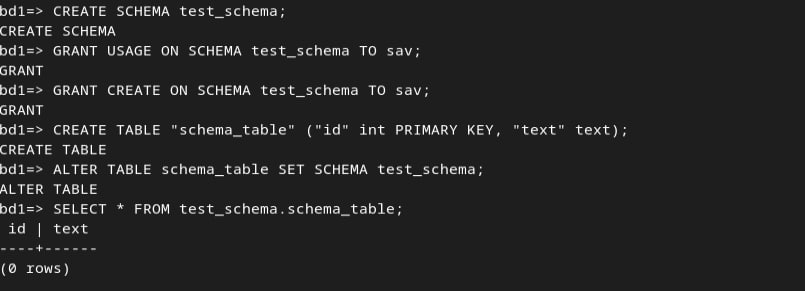{width="6.496527777777778in"
height="1.3745548993875765in"}

Шаг 3. В PostgreSQL, если схема не указана явно, поиск объектов
происходит в схеме по умолчанию (public). Чтобы обратиться к таблице в
другой схеме, нужно указать её полное имя:

SELECT \* FROM test_schema.schema_table;

Шаг 4. (Доп) Работа с search_path

Чтобы обращаться к объектам схемы без явного указания схемы, можно
изменить search_path:

SET search_path TO test_schema;

Теперь команда:

SELECT \* FROM schema_table;

будет эквивалентна:

SELECT \* FROM test_schema.schema_table;

8.  **Использование утилиты psql для базовых операций**

Шаг 1. Создаем таблицу pub_table в схеме public:

CREATE TABLE public.pub_table (

\"id\" int PRIMARY KEY,

\"text\" text

);

{width="6.496527777777778in"
height="0.3631594488188976in"}

Шаг 2. Добавляем несколько строк в таблицу:

INSERT INTO public.pub_table (id, text) VALUES

(1, \'111\'),

(2, \'222\'),

(3, \'333\');

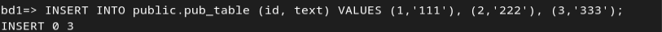{width="6.496527777777778in"
height="0.3196314523184602in"}

Шаг 3. Выбираем все данные из public.pub_table:

SELECT \* FROM public.pub_table;

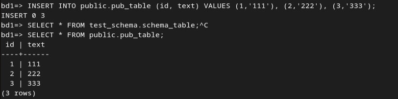{width="6.496527777777778in"
height="1.1157895888013998in"}

Шаг 4. Меняем значение text для строки с id=2:

UPDATE public.pub_table SET text = \'change_me\' WHERE id = 2;

Шаг 5. Удаляем запись с id=3:

DELETE FROM public.pub_table WHERE id = 3;

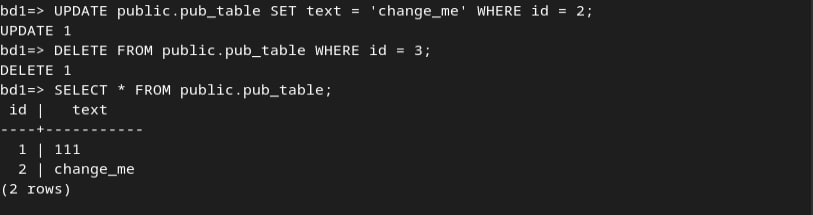{width="6.496527777777778in"
height="1.7180238407699038in"}

Шаг 6. Теперь создаем таблицу new_table в схеме test_schema:

CREATE TABLE test_schema.new_table (

\"id\" int PRIMARY KEY,

\"text\" text

);

{width="6.496527777777778in"
height="0.3684831583552056in"}

Шаг 7. Добавляем записи в новую таблицу:

INSERT INTO test_schema.new_table (id, text) VALUES

(1, \'111\'),

(2, \'222\'),

(3, \'333\');

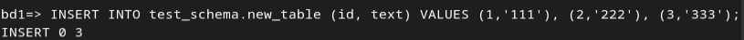{width="6.496527777777778in"
height="0.3507327209098863in"}

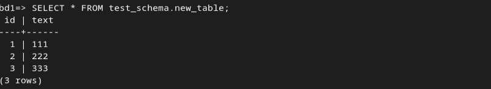{width="6.496527777777778in"
height="1.1797167541557305in"}

9.  **Настройка локальных и сетевых подключений**

Шаг 1. По умолчанию PostgreSQL слушает только локальные соединения
(localhost). Чтобы разрешить подключения с других машин, изменяем
параметр listen_addresses в файле postgresql.conf:

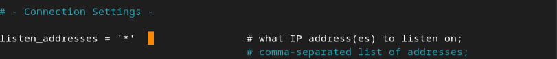{width="6.496527777777778in"
height="0.696913823272091in"}

Важно, после необходимо перезапустить PostgreSQL.

Объяснение:

-   localhost -- сервер принимает подключения только с локального хоста.

-   \* -- сервер принимает подключения с любых IP-адресов.

Шаг 2. Файл /etc/postgresql/15/main/pg_hba.conf управляет правилами
доступа к PostgreSQL. Добавляем строку, разрешающую подключения по
паролю с любого IP-адреса:

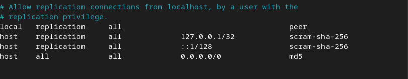{width="6.496527777777778in"
height="1.2576498250218722in"}

Важно, после необходимо перезапустить PostgreSQL.

Разбираем добавленную строку:

-   host -- разрешает подключение по TCP/IP.

-   all -- разрешает подключаться к любым базам данных.

-   all -- разрешает всем пользователям.

-   0.0.0.0/0 -- разрешает подключение с любого IP-адреса.

-   md5 -- требует аутентификацию по паролю.

Шаг 3. Проверка прослушиваемых портов с помощью команды:

sudo ss -tulnp \| grep postgres

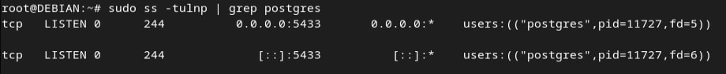{width="6.496527777777778in"
height="0.6637751531058618in"}

Шаг 4. Чтобы узнать IP-адрес сервера, выполним:

hostname -I

{width="6.496527777777778in"
height="0.39590988626421697in"}

Шаг 5. Запускаем DBeaver и создаем новое подключение:

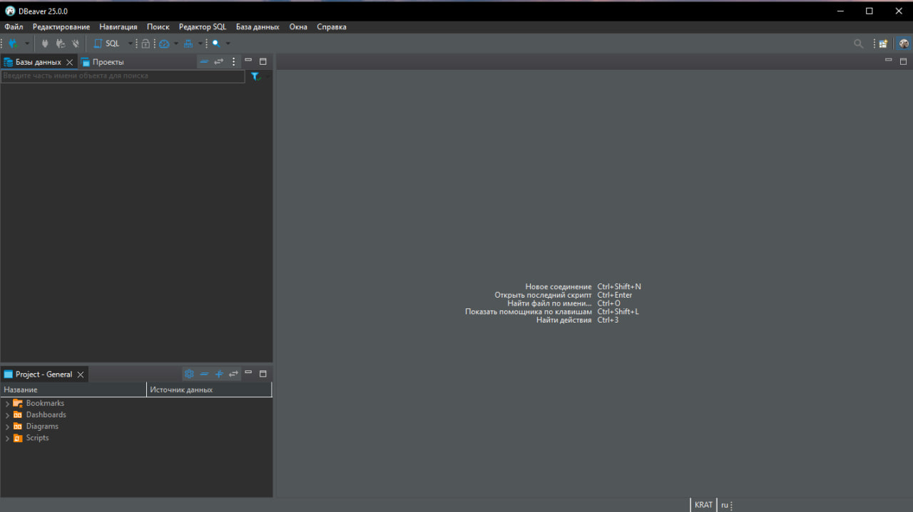{width="6.496527777777778in"
height="3.6492213473315838in"}

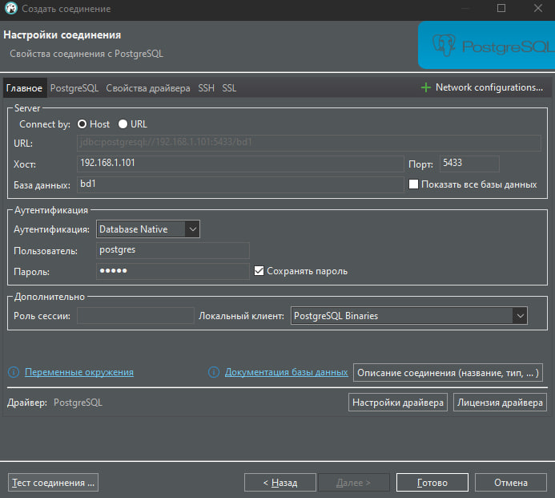{width="6.496527777777778in"
height="5.821562773403325in"}

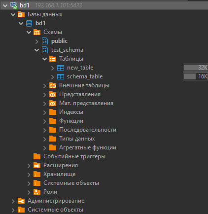{width="4.395833333333333in"
height="4.520833333333333in"}

10. **Журналирование (logging)**

Шаг 1. Открываем файл конфигурации: sudo nano
/etc/postgresql/15/main/postgresql.conf\\

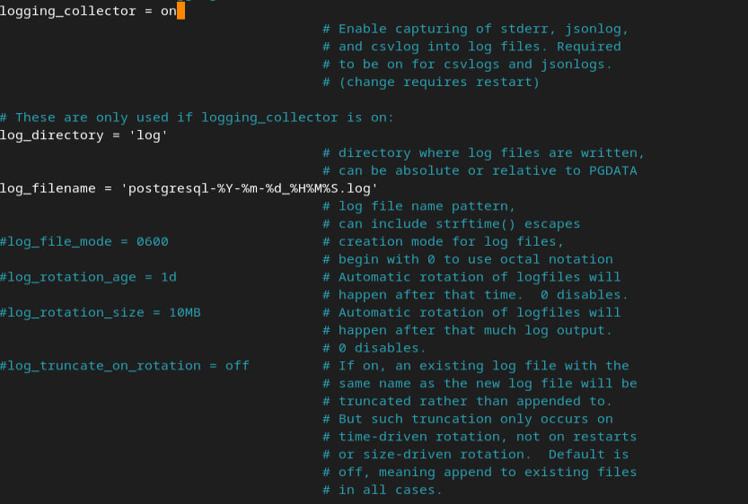{width="6.496527777777778in"
height="3.2721095800524935in"}

Объяснение параметров:

-   logging_collector = on -- включает сбор логов.

-   log_directory = \'log\' -- директория для логов (по умолчанию в
    PGDATA/log).

-   log_filename = \'postgresql-%Y-%m-%d\_%H%M%S.log\' -- лог-файл с
    таймстампом.

-   log_min_messages = info -- записывает все события уровня INFO и
    выше.

-   log_statement = \'all\' -- логирует все SQL-запросы.

-   log_timezone = \'Asia/Krasnoyarsk\' -- устанавливает часовой пояс.

Важно, после внесения изменений требуется перезапустить PostgreSQL.

Шаг 2. Добавляем префикс строк логов:

log_line_prefix = \'%t \[%p\]: \[%l-1\] user=%u, db=%d, app=%a,
client=%h \'

Расшифровка параметров:

-   %t -- временная метка.

-   %p -- PID процесса PostgreSQL.

-   %l -- локальный идентификатор записи лога.

-   %u -- имя пользователя базы данных.

-   %d -- имя базы данных.

-   %a -- приложение, откуда пришел запрос.

-   %h -- IP-адрес клиента.

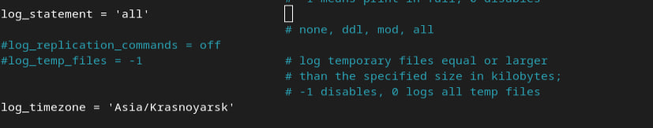{width="6.496527777777778in"
height="1.2804516622922135in"}

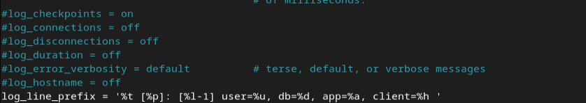{width="6.496527777777778in"
height="1.1473578302712162in"}

Шаг 3. Находим папку с логами:

ls /var/lib/postgresql/15/main/log/

Просматриваем последние строки лога:

tail -f /var/lib/postgresql/15/main/log/postgresql-\*.log

{width="6.496527777777778in"
height="0.4955632108486439in"}

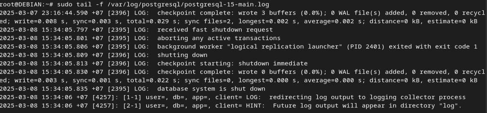{width="6.496527777777778in"
height="1.5154746281714786in"}

Шаг 4. При рестарте PostgreSQL должен появиться лог с информацией о
запуске:

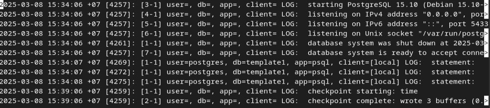{width="6.496527777777778in"
height="1.4422287839020123in"}

11. **Назначение ролей и прав**

Шаг 1. Создаем пользователя lim_u с паролем:

CREATE ROLE lim_u WITH LOGIN PASSWORD \'пароль\';

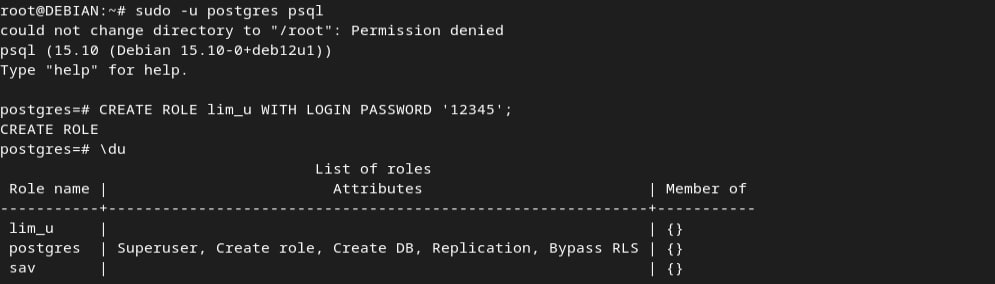{width="6.496527777777778in"
height="1.8542847769028872in"}

Шаг 2. Сощдаем базу test_bd и подключились к ней:\\

CREATE DATABASE test_bd;

\\c test_bd

Шаг 3. Создаем таблицу test_t:

Шаг 4. Выдали права на подключение к базе и на чтение таблицы test_t::

GRANT CONNECT ON DATABASE test_bd TO lim_u;

GRANT SELECT ON test_t TO lim_u;

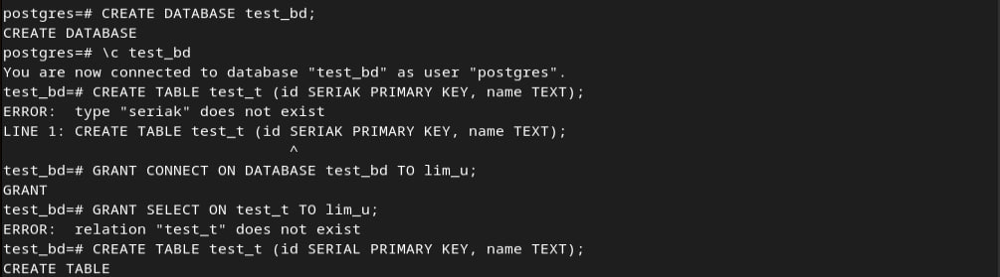{width="6.496527777777778in"
height="1.8035126859142607in"}

Шаг 5. Проверяете права на таблицу test_t с помощью команды \\z test_t:

\\z test_t

{width="6.496527777777778in"
height="1.987937445319335in"}

Шаг 6. Создана роль man, которая была добавлена в lim_u:

CREATE ROLE man WITH LOGIN PASSWORD \'12345\';

GRANT man TO lim_u;

{width="6.496527777777778in"
height="0.4212587489063867in"}

Шаг 7. Вставляем данные в таблицу test_t в базе test_bd:

INSERT INTO test_t (name) VALUES (\'proverka\');

{width="6.496527777777778in"
height="0.15418963254593177in"}
