# **Лабораторная работа №2: резервное копирование, восстановление и мониторинг в Debian и PostgreSQL**

# **Шикан Алексей Владимирович ИС-21**

### 1. Утилиты резервного копирования

```pg_dump:```

-   Используется для создания дампов отдельных баз данных.

-   Поддерживает выборочный дамп (схемы, таблицы).

-   Может генерировать дампы в различных форматах (plain, custom, tar).

```pg_basebackup:```

-   Применяется для создания физического резервного копирования всего
    кластера PostgreSQL.

-   Используется для организации репликации и создания горячих резервных
    копий.

Сценарии применения:

> ```pg_dump```: резервное копирование отдельных баз данных, частичное
> копирование (схемы, таблицы).
>
> ```pg_basebackup```: создание полного снимка данных для восстановления после
> сбоя.

### 2. Создание резервной копии 

Шаг 1. Переходим под пользователя postgres

```pg_dump -U postgres -Fc -f bd1_backup.dump```

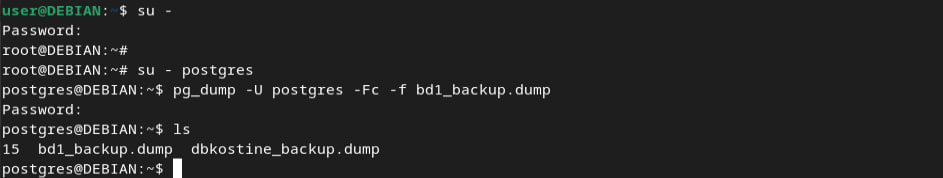

Шаг 2. После выполнения команды убедимся, что файл дампа появился в
рабочем каталоге:

```ls```

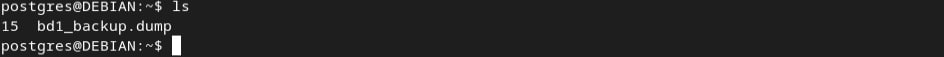

#### **Форматы бэкапа**

1.  **Формат Custom (ключ -Fc) -** Это проприетарный формат PostgreSQL,
    который часто называют «custom». Позволяет восстанавливать
    **выборочно** таблицы, схемы, функции и т.д.

> **Особенности:**

-   Можно использовать опцию **параллельного** восстановления (параметр
    -j при pg_restore).

-   Файл такого бэкапа нельзя просто «прочитать» как текст --- это
    двоичный формат.

2.  **Формат Tar (ключ -Ft)** - Создаёт архив в формате tar, содержащий
    необходимые файлы.

> **Особенности:**

-   Технически можно открыть tar-архив и просмотреть его содержимое, но
    его структура специфична для PostgreSQL.

-   Позволяет частично восстанавливать объекты, однако требует
    аккуратности при ручной распаковке, так как внутри tar лежит формат
    PostgreSQL.

3.  **Формат Plain text (ключ -Fp или по умолчанию, если -F не указан)
    -** Представляет собой обычный SQL-скрипт, который можно просмотреть
    и отредактировать в любом текстовом редакторе.

> **Особенности:**

-   Процесс восстановления: ```psql -U \<user\> -d \<dbname\> -f dump.sql```.

-   Нельзя выбирать, какие объекты восстанавливать --- восстанавливается
    всё, что есть в SQL-скрипте.

## **Другие полезные параметры pg_dump**

-   ```-d``` или ```--dbname``` -- указывает имя базы данных.

-   ```-U <username>``` -- имя пользователя PostgreSQL, от которого
    выполняется дамп.

-   ```-h <host>``` -- указывает хост (сервер), где работает PostgreSQL (по
    умолчанию localhost).

-   ```-p <port>``` -- указывает порт (по умолчанию 5432).

-   ```-v``` или ```--verbose``` -- подробный вывод информации (полезно при
    отладке).

-   ```-f <filename>``` -- путь к файлу, куда сохраняется дамп.

-   ```-n <schema>``` или ```--schema=<schema>``` -- копирование только
    указанной схемы.

-   ```-t <table>``` или ```--table=<table>``` -- копирование только указанной
    таблицы (или нескольких таблиц, если указать ключ несколько раз).

-   ```-a``` или ```--data-only``` -- копировать только данные, без структуры
    таблиц.

-   ```-s``` или ```--schema-only``` -- копировать только схему (DDL), без данных.

-   ```--exclude-table=<table>``` -- исключить определённые таблицы из
    бэкапа.

-   ```--column-inserts``` -- генерировать INSERT-запросы с явным
    перечислением колонок (удобно для чтения или частичного
    восстановления).

-   ```-Z <0-9>``` или ```--compress=<0-9>``` -- уровень сжатия (по умолчанию 0
    или 6, в зависимости от формата). Используется с форматом custom или
    directory.

-   ```-j <num>``` -- параллельное резервное копирование (работает только с
    форматом directory (```-Fd```) или custom (```-Fc```)).

### 3. Частичное (выборочное) резервное копирование

Шаг 1. Команда для дампа определенной схемы test_schema:

```pg_dump -U postgres -n test_schema -Fc -f backup_s.dump bd1```

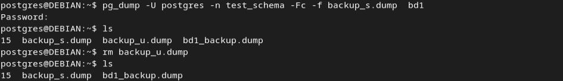

Шаг 2. Команда для дампа отдельной таблицы public.pub_table:

```pg_dump -U postgres -t public.pub_table -Fc -f backup_t.dump bd1```

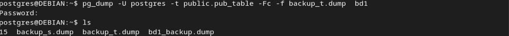

Шаг 3. Команда для дампа бд bd1:

```pg_dump -U postgres -Fc -f bd1_full_backup.dump bd1```

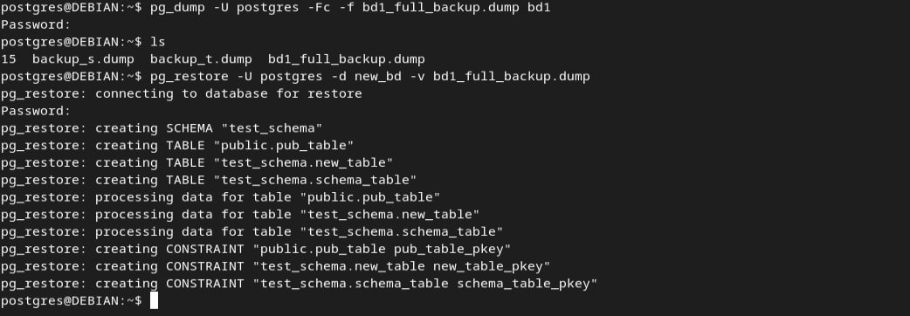

### 4. Восстановление из резервной копии

Шаг 1. Подготовка к восстановлению - создание новой базы для
восстановления:

```createdb -U postgres new_bd```

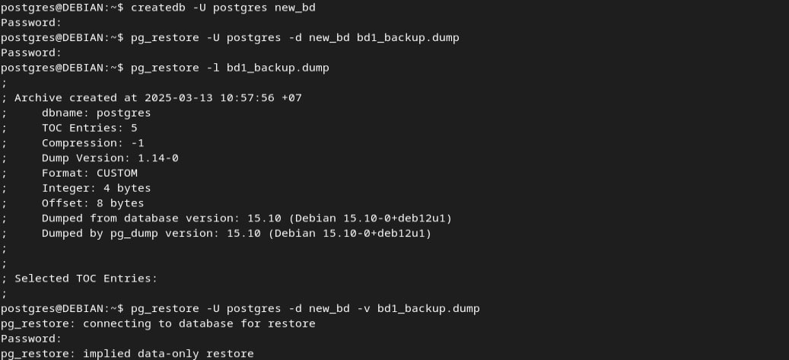

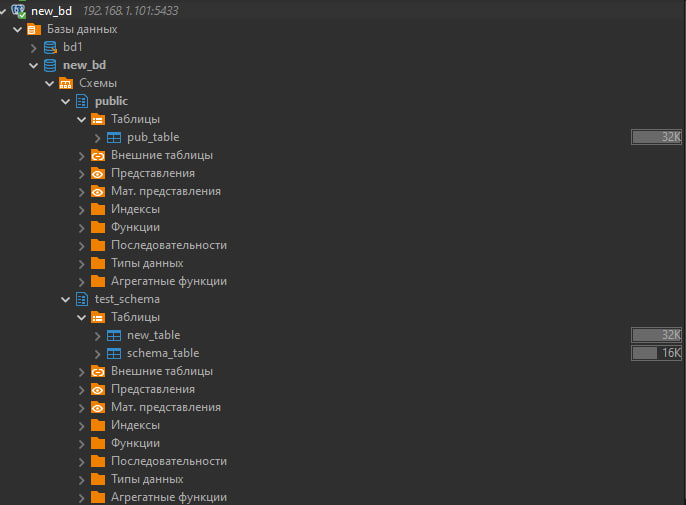

Шаг 2. Используем ```pg_restore```, чтобы загрузить данные из файла
```bd1_backup.dump``` в только что созданную базу ```new_bd```

```pg_restore -U postgres -d new_bd bd1_backup.dump```

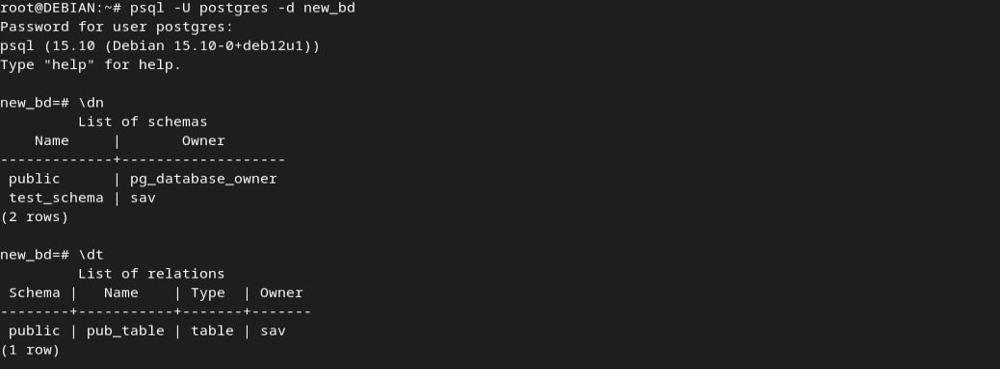

### 5. Автоматизация бэкапов с помощью cron

Шаг 1. Создадим папку для бэкапов и назначается владельцем пользователь
postgres.

Шаг 2. В crontab (через ```crontab -e```) добавляются две задачи:

-   Создание резервной копии базы ```bd1``` каждую минуту

-   Ротация бэкапов. Ротация резервных копий - это процесс управления
    «старыми» дампами: хранится лишь необходимое количество (или
    необходимый период по дням/неделям/месяцам), а слишком старые дампы
    удаляются.

###### 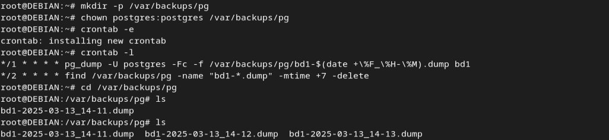{width="6.496527777777778in" height="1.506991469816273in"}

### 6. Мониторинг состояния системы

Шаг 1. Использование ```top``` - показывает в реальном времени список
процессов и суммарную статистику по системе.

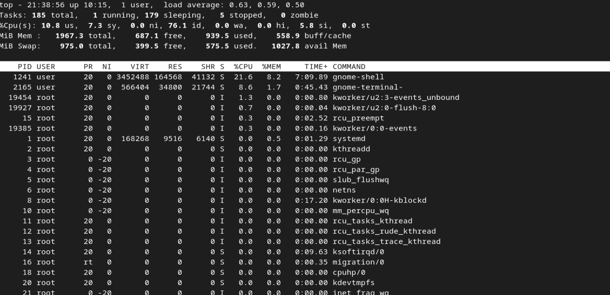

Шаг 2. Использование ```htop``` улучшенная версия top, которая показывает
процессы в более наглядном интерфейсе, с цветными индикаторами CPU, RAM,
Swap.

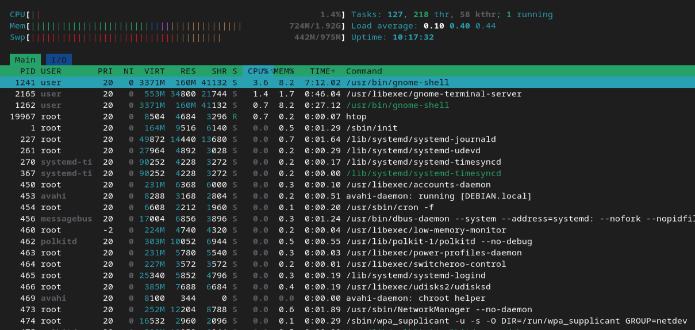

Шаг 3. Использование ```iotop``` --- утилита для мониторинга дискового
ввода-вывода (IO

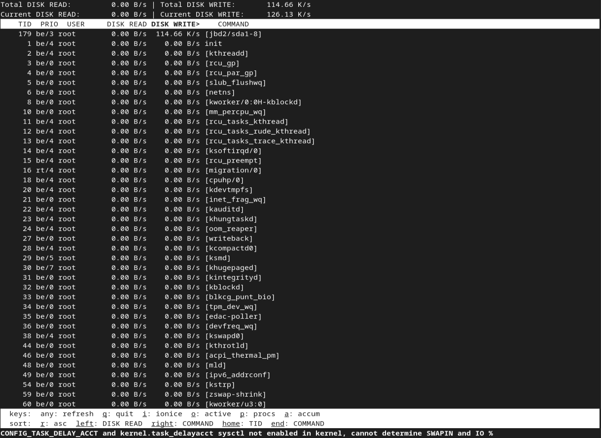

### 7. Мониторинг PostgreSQL

Шаг 1. Используем ```pg_stat_activity``` - текущее состояние всех подключений
и выполняемых запросов. ```pg_stat_database``` - статистика по всем базам
данных: количество запросов, ошибки, объемы чтения/записи и т. д.

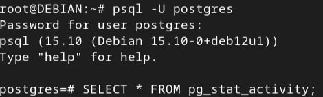

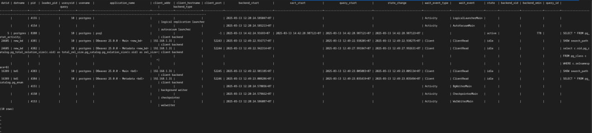

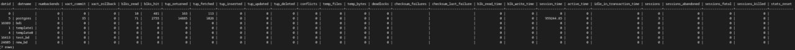

Шаг 2. Создадим \"долгий запрос\"


Шаг 3. Команда для того, чтобы увидеть активные процессы и запросы


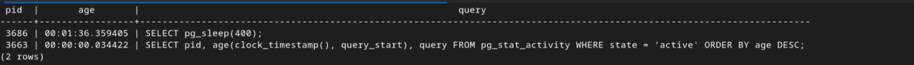

Шаг 4. Команда для того, чтобы смотреть все процессы:

```SELECT pid, usename, application_name, state, query, query_start FROM pg_stat_activity;```

Шаг 5. Для поиска запросов, которые выполняются слишком долго,
используем команду:

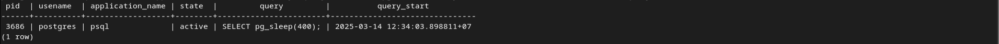

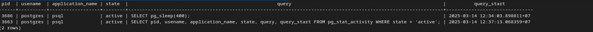

Шаг 6. Для принудительное завершение запроса:

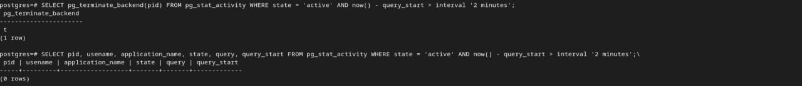

### 8. Логирование и анализ логов

Шаг 1. Выводим последние 50 строк журнала сервиса cron:

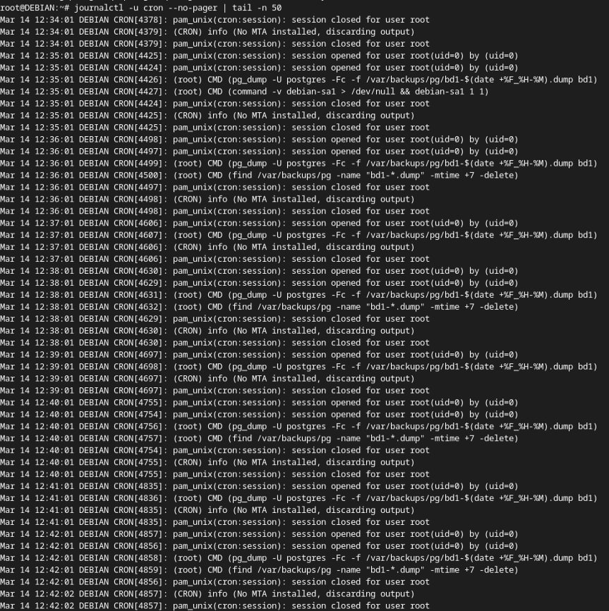

Шаг 2. Просмотр содержимого каталога /var/log/postgresql/.
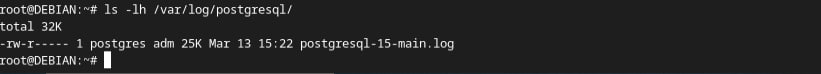

Шаг 3. Выведем общие системные логи в Debian\
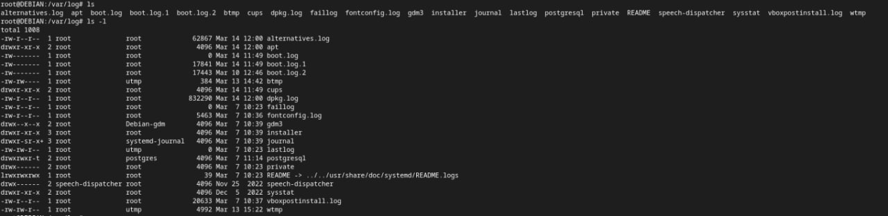

Шаг 4. В реальном времени отслеживаем лог PostgreSQL

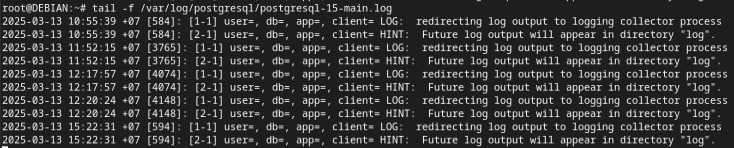
