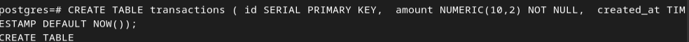
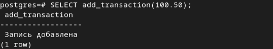

# **Лабораторная работа №3: Расширенные возможности и оптимизация PostgreSQL на Debian**

# **Шикан Алексей Владимирович ИС-21**

### 1. Оптимизация конфигурации PostgreSQL

Шаг 1. Узнать общий объем RAM при помощи команды:

```free -h```


Шаг 2. Виртуальная машина имеет 1.9 ГБ оперативной памяти. Далее
настроим параметры ```postgresql.conf``` исходя из этого. Открываем
конфигурационный файл:

```sudo nano /etc/postgresql/14/main/postgresql.conf```


Ниже приведены параметры, влияющие на производительность:

-   ```shared_buffers``` - объем памяти, выделяемый PostgreSQL для
    кеширования страниц БД. Обычно устанавливается в 25-40% от общей
    ОЗУ.

-   ```work_mem``` - объем памяти, выделяемый на одну сортировку или
    хэш-операцию в запросе. Если запрос использует несколько сортировок,
    умножается на их число.

-   ```maintenance_work_mem``` - память, выделяемая для операций обслуживания
    (например, VACUUM, CREATE INDEX).

-   ```effective_cache_size``` - размер файлового кеша ОС, который PostgreSQL
    может использовать. Обычно 50-75% от общей ОЗУ.

Настраиваем параметры:


Обоснование выбора:

-   ```shared_buffers``` = 512MB - примерно 25% от 1.9 ГБ.

-   ```work_mem``` = 16MB - сбалансировано для ограниченной памяти.

-   ```maintenance_work_mem``` = 128MB - достаточно для VACUUM и CREATE
    INDEX.

-   ```effective_cache_size``` = 1GB - соответствует доступному кешу ОС.

Шаг 3. Перезапускаем PostgreSQL

```sudo systemctl restart postgresql```

Шаг 4. Проверяем установленные параметры:

```SHOW shared_buffers;```

```SHOW work_mem;```

```SHOW maintenance_work_mem;```

```SHOW effective_cache_size;```


### 2. Создание и анализ индексов

Шаг 1. Создадим таблицу ```orders``` с большим количеством данных:


Шаг 2. Заполним таблицу данными с помощью ```generate_series```:


Шаг 3. Выполняем запрос без индексов:

```EXPLAIN ANALYZE SELECT * FROM orders WHERE customer_id = 500;```


Тут видим ```Seq Scan (Sequential Scan)``` в плане запроса, что означает, что
PostgreSQL просматривает всю таблицу построчно.

Шаг 4. Добавим индекс на ```customer_id```, чтобы ускорить поиск заказов по
этому полю:

```CREATE INDEX idx_orders_customer ON orders (customer_id);```


Шаг 5. Проверим выполнения шага 4.

```EXPLAIN ANALYZE SELECT * FROM orders WHERE customer_id = 500;```


Теперь в плане запроса есть ```Index Scan``` и время выполнения стало в разы
меньше.

**Сравнение результатов:**

-   До индекса: ```Seq Scan```, медленный поиск.

-   После индекса: ```Index Scan```, значительно более быстрый поиск.

Таким образом, индексация помогает оптимизировать выполнение запросов,
особенно при работе с большими таблицами.

### 3. Хранимые функции.

Шаг 1. Создадим таблицу ```transactions```, в которую будем вставлять данные с
проверкой:



Шаг 2. Создание функции проверки и вставки данных в ```nano```:


Шаг 3. Выполним тестовый вызов функции:

```SELECT add_transaction(100.50);```



Шаг 4. Передаем отрицательное значение:

```SELECT add_transaction(-50);```


Шаг 5. Посмотрим содержимое таблицы:

```SELECT * FROM transactions;```


Видим только одну запись, отрицательной нет.

### 4. Триггеры

Шаг 1. Создадим таблицу ```products```, где будет храниться информация о
товарах. Добавим ограничение, что цена (price) не может быть
отрицательной.


Шаг 2. Создадим функцию для триггера:


Шаг 3. Добавим триггер, который будет автоматически вызывать функцию
```check_price()``` перед вставкой (INSERT) и обновлением (UPDATE)

```CREATE TRIGGER trigger_check_price```

```BEFORE INSERT OR UPDATE ON products```

```FOR EACH ROW```

```EXECUTE FUNCTION check_price();```

Шаг 4. Проверка триггера и разных сценариев с ним:


### 5. Автоматическая очистка и статистика (VACUUM, ANALYZE)

Шаг 1. Перед выполнением ```VACUUM``` и ```ANALYZE``` убедимся, что автоочистка
(autovacuum) включена. Для этого выполним команду:

```SHOW autovacuum;```


Шаг 2. Просмотрим важные параметры автоочистки:

```SHOW autovacuum_naptime;``` - как часто (в секундах) запускается
автоочистка (по умолчанию 60 сек).

```SHOW autovacuum_vacuum_scale_factor;``` - когда запустить VACUUM (% от
изменения строк).

```SHOW autovacuum_analyze_scale_factor;``` - когда запустить ANALYZE (% от
изменения строк).


Шаг 3. ```VACUUM``` удаляет \"мёртвые\" строки, а ```ANALYZE``` обновляет статистику
запросов. Выполним очистку и обновление статистики для конкретной
таблицы:

```VACUUM ANALYZE products;```


Шаг 4. Проверим состояние таблицы после очистки:

```SELECT relname, n_live_tup, n_dead_tup, autovacuum_count, autoanalyze_count```

```FROM pg_stat_user_tables;```


Что показывают столбцы?

-   ```relname``` - имя таблицы.

-   ```n_live_tup``` - количество актуальных строк.

-   ```n_dead_tup``` - количество \"мёртвых\" строк (если много, нужно
    VACUUM).

-   ```autovacuum_count``` - сколько раз autovacuum запускался.

-   ```autoanalyze_count``` - сколько раз запускался autoanalyze.

Шаг 5. Проверка статистики индексов:

```SELECT relname, indexrelname, idx_scan, idx_tup_read, idx_tup_fetch```

```FROM pg_stat_all_indexes```

```WHERE schemaname = 'public';```


Что показывают столбцы?

-   ```indexrelname``` - название индекса.

-   ```idx_scan``` - сколько раз индекс использовался.

-   ```idx_tup_read``` - сколько строк прочитано через индекс.

-   ```idx_tup_fetch``` - сколько строк реально использовано.

Шаг 6. Проверка истории autovacuum и manual vacuum:

```SELECT relname, autovacuum_count, autoanalyze_count, vacuum_count, analyze_count```

```FROM pg_stat_user_tables;```


Параметры:

-   ```autovacuum_count``` - количество запусков автоочистки.

-   ```autoanalyze_count``` - количество автообновлений статистики.

-   ```vacuum_count``` - количество ручных запусков VACUUM.

-   ```analyze_count``` - количество ручных запусков ANALYZE.

### **Вывод**

1.  ```autovacuum``` автоматически чистит \"мёртвые\" строки и обновляет
    статистику.

2.  ```VACUUM ANALYZE``` помогает вручную оптимизировать производительность.

3.  ```pg_stat_user_tables``` и ```pg_stat_all_indexes``` позволяют анализировать
    работу очистки.
